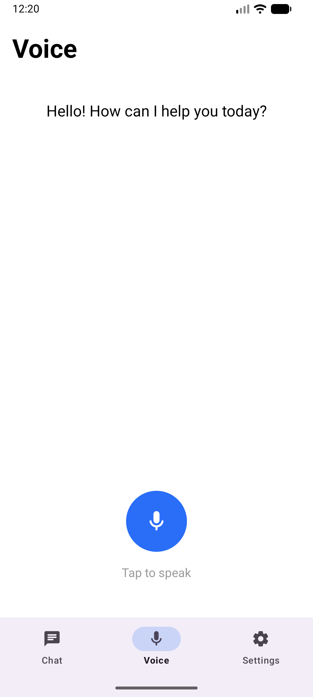

# AssistantAI

# How to build a APK file (For Testing):
1. Open project in Android Studio.
2. Go to the top menu bar and select Build.
3. Select Build Bundle(s) / APK(s).
4. Click Build APK(s).
5. Wait for the Gradle build to finish.
6. A notification will appear at the bottom right. Click locate to open the folder containing your .apk file.
7. Copy .apk to a device and install
8. Voilà ;)

# Screenshots

